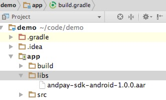

## 和付支付安卓sdk接入文档

### 一、快速集成
#### 导入sdk
##### gradle导入方式
1、在项目中的build.gradle中添加jcenter远程仓库

```
buildscript {
    repositories {
        jcenter()
    }
}
allprojects {
    repositories {
        jcenter()
    }
}
```
2、在module中的build.gradle中添加sdk远程依赖

```
dependencies{
	compile 'me.andpay.mobile.sdk:andpay-sdk-android:1.0.0'
}
```

##### maven导入方式
```
<dependency>
  <groupId>me.andpay.mobile.sdk</groupId>
  <artifactId>andpay-sdk-android</artifactId>
  <version>1.0.0</version>
  <type>pom</type>
</dependency>
```

##### 下载sdk导入
将下载的andpay-sdk-android-1.0.0.aar拷贝到module的libs目录，并在module的build.gradle中添加如下配置：

```
repositories{
    flatDir{
    	dirs 'libs'
    }
}
dependencies{
	compile(name:'andpay-sdk-android-1.0.0',ext:'aar')
}
```



#### sdk权限要求
所有权限均已在sdk中声明，为确保交易的正常进行及交易过程的安全性，以下权限均必须获取，否则可能导致交易失败

##### 1、通用权限
```
<uses-permission android:name="android.permission.INTERNET"/>
<uses-permission android:name="android.permission.ACCESS_NETWORK_STATE"/>
<uses-permission android:name="android.permission.ACCESS_WIFI_STATE"/>
<uses-permission android:name="android.permission.READ_PHONE_STATE"/>
```
##### 2、定位权限

```
<uses-permission android:name="android.permission.ACCESS_COARSE_LOCATION"/>
<uses-permission android:name="android.permission.ACCESS_FINE_LOCATION"/>
```

### 二、发起支付
#### 初始化sdk
在使用sdk前需要对sdk进行初始化配置，否则可能导致sdk支付失败，初始化配置只需要进行一次

```
AndpaySdkManager.init(andpaySdkConfig)
```
#### 发起支付

```
//发起订单支付，activity：当前activity；orderToken：64位订单令牌，需从和付服务端生成；andpaySdkCallback：sdk结果回调（可选）
AndpaySdkManager.payOrder(activity,orderToken,andpaySdkCallback);
```
#### 权限申请
发起支付过程中，需要获取定位等权限，sdk中已经集成了动态权限申请功能，若项目的targetSdkVersion>=23时，请复写Activity的onRequestPermissionsResult方法

```
@Override
public void onRequestPermissionsResult(int requestCode, String[] permissions, int[] grantResults) {
    if(requestCode == 79801){
        AndpaySdkManager.onRequestPermissionsResult(requestCode,permissions,grantResults);
    }
}
```

#### 结果回调
##### 成功
订单支付成功时调用

```
paySuccess(AndpaySdkResponse response);
```

##### 取消
用户主动点击退出or返回，取消交易时调用

```
payCancel();
```

##### 失败
sdk初始化失败、权限获取失败、网络异常、订单支付失败等情况下调用

```
payFailed(String errorCode,String errorMsg);
```

错误码

错误码|      说明       |  
-----|------------------|
1000 |sdk内部错误 |
1001 |初始化错误（sdk初始化失败or订单初始化失败）|
1002 |无效的orderToken|
1003 |网络异常|
1099 |权限获取失败|
1010 |定位获取失败|
1101 |支付失败|


### 注意事项

#### 混淆配置
如果项目中有代码混淆配置，请将一下配置加入混淆规则中：

```
-keepclassmembers class me.andpay.sdk.fastpay.**{
    *;
}
```

#### 日志
初始化sdk时，debug参数默认为false，将debug模式打开后，sdk将输出更加详细的日志


